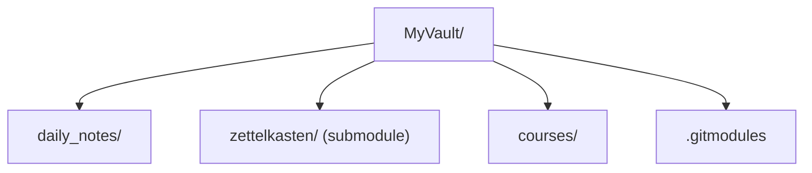

---
tags:
  - evergrow/seed
---
# Что такое git submodule

**Submodule** — это способ включить один репозиторий внутри другого. Он хранит ссылку на конкретный коммит внутреннего репозитория, позволяя вести его историю отдельно от основного проекта.

Пример структуры:



---

# Основные действия
## Добавление submodule

1. Перейдите в корень основного репозитория:

``` bash
cd MyVault
git init  # если ещё не инициализирован
```

2. Добавьте папку как submodule:

```bash
git submodule add <url_репозитория> <путь_в_проекте>
```

Например:

```bash
git submodule add git@github.com:username/zettelkasten.git zettelkasten`
```

Это создаст:

- Папку `zettelkasten` с отдельным git-репо внутри.
- Файл `.gitmodules` с настройками submodule:

```ini
[submodule "zettelkasten"]
     path = zettelkasten
     url = git@github.com:username/zettelkasten.git`
```


---

## commit и push submodule

- Чтобы зафиксировать текущую версию submodule в основном репо:
```bash
cd zettelkasten
# работаем как обычно в подмодуле
git add .
git commit -m "Обновление заметок" 
git push origin main  

cd .. 
git add zettelkasten 
git commit -m "Обновлен submodule zettelkasten" 
git push origin main
```


>[!important] Важно:
> основной репозиторий хранит **ссылку на конкретный коммит** submodule, а не весь репозиторий.

---

## Клонирование проекта с submodule

Если кто-то клонирует твой основной репозиторий:

```bash
git clone --recurse-submodules <url_основного_репо>
```

Или после клона:

```bash
git submodule init git submodule update
```

Для обновления submodule:

```bash
git submodule update --remote --merge
```

---

## Настройка `.gitmodules`

Файл `.gitmodules` выглядит так:
```ini
[submodule "zettelkasten"]
    path = zettelkasten
    url = git@github.com:username/zettelkasten.git
    branch = main
```

### Полезные параметры

|Параметр|Описание|
|---|---|
|`path`|Путь к подмодулю внутри проекта|
|`url`|URL репозитория подмодуля|
|`branch`|Ветка submodule, которую git будет отслеживать при `git submodule update --remote`|

---

## Работа с ветками submodule

- Перейдите внутрь папки submodule:
```bash
cd zettelkasten git checkout main git pull
```

- Чтобы submodule всегда обновлялся на последнюю версию ветки:
```bash 
git config -f .gitmodules submodule.zettelkasten.update merge
```

---

## Удаление submodule

1. Удалить запись из `.gitmodules`.
2. Удалить запись из `.git/config`:
```bash
git submodule deinit -f zettelkasten git rm -f zettelkasten rm -rf .git/modules/zettelkasten
```
